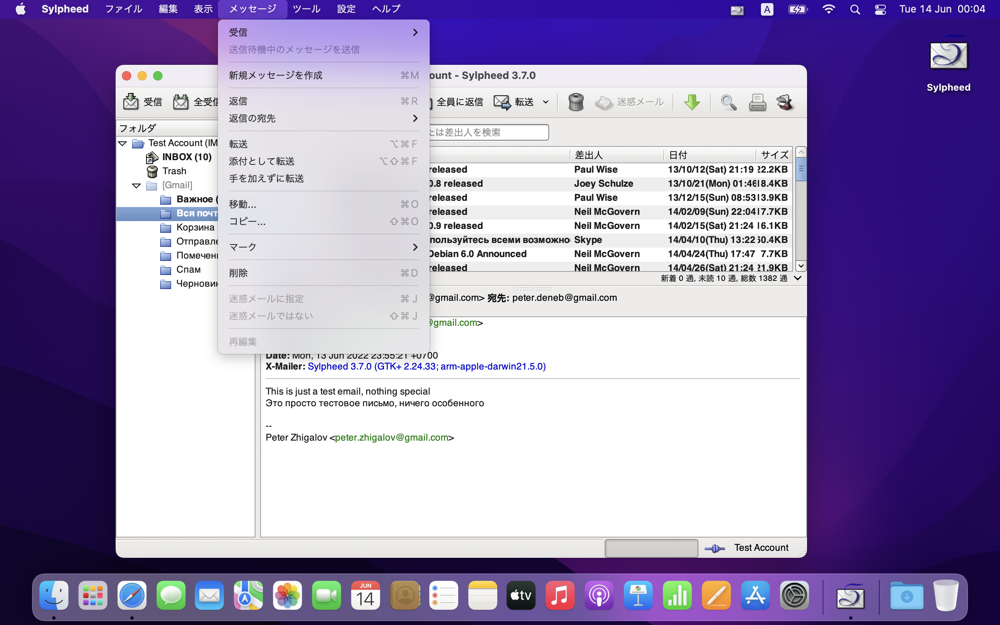

# Sylpheed for macOS

## About Sylpheed
[Sylpheed](https://sylpheed.sraoss.jp/en/) is a simple, lightweight but featureful, and easy-to-use e-mail client.
Sylpheed is a free software distributed under the [GNU GPL](https://www.gnu.org/licenses/old-licenses/gpl-2.0.html).

## About Sylpheed for macOS
This software works on macOS 10.10 (Yosemite) or later. It runs on any Mac with a 64-bit Intel processor or an Apple Silicon chip. It has been tested on 12.7.6 (Monterey) and 15.6 (Sequoia).
Though Sylpheed for macOS is stable, please note that it has various issues because it is still testing stage.

## Screenshots

## See also
* https://sylpheed.sraoss.jp/en/
* https://sylpheed.sraoss.jp/sylpheed/macosx/
* https://github.com/sylpheed-mail/sylpheed
* https://github.com/AlienCowEatCake/sylpheed-windows
