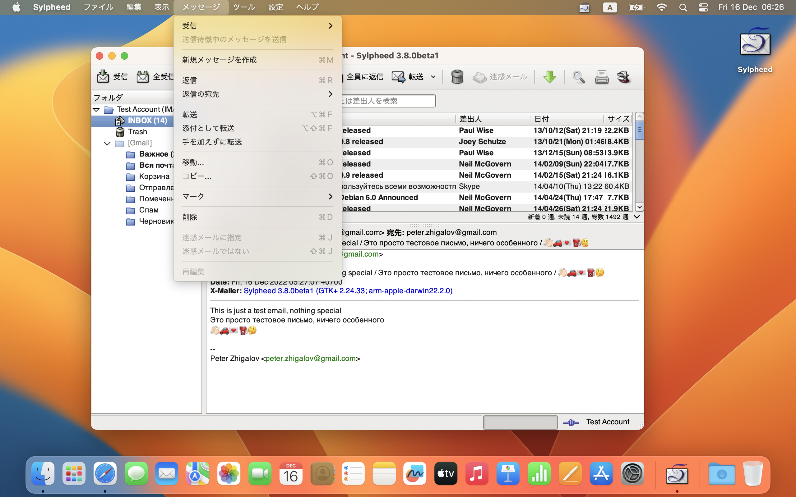

# Sylpheed for Mac OS X

## About Sylpheed
[Sylpheed](http://sylpheed.sraoss.jp/) is a simple, lightweight but featureful, and easy-to-use e-mail client.
Sylpheed is a free software distributed under the [GNU GPL](https://www.gnu.org/licenses/old-licenses/gpl-2.0.html).

## About Sylpheed for Mac OS X
This software works on Mac OS X 10.9 (Mavericks) or later. It runs on any Mac with a 64-bit Intel processor or an Apple Silicon chip. It has been tested on 10.9.5 (Mavericks), 10.11.6 (El Capitan) and 13.4 (Ventura).
Though Sylpheed for Mac OS X is stable, please note that it has various issues because it is still testing stage.

## Screenshots

## See also
* https://sylpheed.sraoss.jp/en/
* https://sylpheed.sraoss.jp/sylpheed/macosx/
* https://github.com/sylpheed-mail/sylpheed
* https://github.com/AlienCowEatCake/sylpheed-windows
